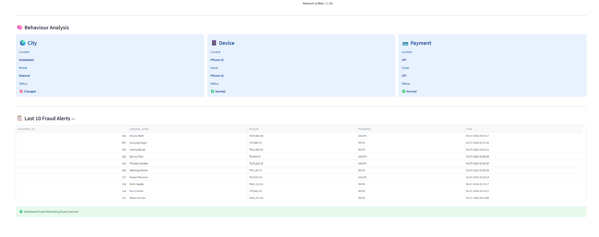

# 🚀 Real-Time Financial Fraud Detection System

<p align="center">


</p>

---

## 📌 Project Overview

Unlike traditional ML projects built on static Kaggle datasets, this project recreates a production-style fraud detection pipeline by simulating live banking transactions, dynamically generating behavioral features from historical customer data, performing real-time fraud prediction using XGBoost, and visualizing live fraud alerts through an interactive Streamlit dashboard. The entire system is fully Dockerized for one-command deployment.

---

## 📸 Dashboard Preview
<p align="center">
  
</p>

----

# ✨ Features

## 🔹 Real-Time Transaction Simulation
- Generates realistic banking transactions based on customer behavior profiles.
- Simulates spending patterns, device usage, payment methods, and locations.
- Injects rare fraudulent transactions using multiple fraud scenarios.

## 🔹 Machine Learning Fraud Detection
- Uses a trained **XGBoost** model to classify incoming transactions.
- Performs real-time feature engineering before prediction.
- Calculates fraud probability for every transaction.
- Updates the database instantly with prediction results.

## 🔹 Interactive Streamlit Dashboard
- Displays live transactions as they are generated.
- Highlights suspicious transactions in real time.
- Shows fraud probability and transaction details.
- Refreshes automatically without restarting the application.

## 🔹 MySQL Database
- Stores customer information.
- Maintains historical transaction data.
- Receives live simulated transactions.
- Stores fraud predictions and monitoring metrics.

## 🔹 Dockerized Deployment
- One-command deployment using Docker Compose.
- Automatically starts:
  - MySQL Database
  - Live Transaction Simulator
  - Fraud Detection Engine
  - Streamlit Dashboard

## 🔹 End-to-End Pipeline
- Historical Data Generation
- Customer Profile Creation
- Live Transaction Simulation
- Machine Learning Prediction
- Real-Time Dashboard Monitoring--

---

# ⚙️ Technology Stack

| Category | Technology |
|----------|------------|
| **Programming Language** | Python 3.11 |
| **Machine Learning** | XGBoost |
| **Database** | MySQL 8 |
| **Dashboard** | Streamlit |
| **Containerization** | Docker |
| **Container Orchestration** | Docker Compose |
| **Data Processing** | Pandas, NumPy |
| **Database Connector** | MySQL Connector/Python |
| **Model Persistence** | Joblib |
| **Environment Management** | python-dotenv |
| **Version Control** | Git & GitHub |


# 🚀 Quick Start

## 1️⃣ Clone the Repository

```bash
git clone https://github.com/Mani4code/financial-fraud-detection-system.git
cd financial-fraud-detection-system
```

## 2️⃣ Create the Environment File

### Windows

```powershell
copy .env.example .env
```

### Linux / macOS

```bash
cp .env.example .env
```

## 3️⃣ Start the Application

```bash
docker compose up --build
```

Once all services are running, open:

```
http://localhost:8501
```

---

# 💻 Development Mode (Separate Terminals)

If you prefer monitoring each service separately during development, start each service in its own terminal.

### Terminal 1 – MySQL

```bash
docker compose up mysql
```

### Terminal 2 – Live Simulator

```bash
docker compose up simulator
```

### Terminal 3 – Fraud Detector

```bash
docker compose up detector
```

### Terminal 4 – Streamlit Dashboard

```bash
docker compose up dashboard
```

Then open:

```
http://localhost:8501
```

---

# 🛑 Stop the Application

```bash
docker compose down
```
---

# 📂 Project Structure

```text
financial-fraud-detection-system/
│
├── app/
│   ├── dashboard.py              # Streamlit dashboard
│   ├── detector.py               # Real-time fraud detection engine
│   ├── live_simulator.py         # Live transaction simulator
│   └── __init__.py
│
├── assets/
│   ├── architecture.png
│   ├── dashboard.png
│   ├── dashboard_dark.png
│   └── demo.gif
│
├── database/
│   ├── init/
│   │   └── history_builder.sql   # Database initialization script
│   ├── history_builder.ipynb
│   └── README.md
│
├── docs/
│   ├── architecture.md
│   ├── api_documentation.md
│   └── project_report.pdf
│
├── model/
│   ├── customer_generator.py
│   ├── feature_engineering.py
│   ├── customer_profiles.json
│   ├── featured_transactions.csv
│   ├── fraud_detection_model.pkl
│   ├── fraud_model_training.ipynb
│   └── training_data_generator.ipynb
│
├── Dockerfile
├── docker-compose.yml
├── requirements.txt
├── .env.example
├── .dockerignore
├── .gitignore
├── LICENSE
└── README.md
```
---

# 🤖 Machine Learning Pipeline

The fraud detection model follows a complete machine learning pipeline:

```text
Historical Transactions
        │
        ▼
Feature Engineering
        │
        ▼
Training Dataset
        │
        ▼
XGBoost Model Training
        │
        ▼
fraud_detection_model.pkl
        │
══════════════════════════════
      Real-Time Prediction
══════════════════════════════
        │
        ▼
Live Transaction
        │
        ▼
Feature Engineering
        │
        ▼
XGBoost Prediction
        │
        ▼
Fraud Probability
        │
        ▼
Dashboard & Database Update
```

### Features Used

- Transaction Amount
- Customer Average Amount
- Customer Maximum Amount
- Amount Deviation
- Amount Growth Ratio
- Amount vs Maximum
- Device Change Detection
- City Change Detection
- Payment Method Change Detection
- Transaction Count (Last 24 Hours)

The trained model predicts the probability of fraud for every incoming transaction and updates the database in real time.
---

# 📊 Model Performance

The fraud detection model was trained using **XGBoost** on engineered customer transaction features.

| Metric | Score |
|---------|-------|
| Model | XGBoost Classifier |
| Precision | 89.30% |
| Recall | 79.25% |
| F1-Score | 83.97% |

### Feature Importance

The most influential features used by the model include:

- Amount Growth Ratio
- Customer Average Amount
- Amount vs Maximum
- Device Change Detection
- City Change Detection
- Payment Method Change Detection
- Previous Transaction Amount
- Customer Maximum Amount
- Transaction Count (Last 24 Hours)

The trained model predicts a fraud probability for every incoming live transaction. Transactions exceeding the configured threshold are flagged as fraudulent and displayed instantly on the monitoring dashboard.

## 📑 Table of Contents

- Project Overview
- Features
- System Architecture
- Technology Stack
- Project Structure
- Machine Learning Pipeline
- Docker Architecture
- Installation
- Running the Project
- Dashboard
- Future Enhancements
- Author
- License
